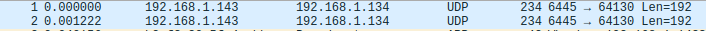

# Midea U Shaped Air Conditioner

## LAN Connectivity 

There were some rumors that the Midea AC unit communicates over LAN instead of WAN when you're at home. However, third party libraries 
developed to talk with the AC unit only do so through Midea's cloud API instead. 

### Network Capture

To see if we're actually communicating over LAN, I used my router which is running DD-WRT to capture traffic using `tcpdump`.

My router unfortunately does not have a ton of free disk space, so we'll need to redirect the output of the network capture to my desktop.

```
> mkfifo /tmp/redirected_capture
> wireshark -k -i /tmp/redirected_capture
> ssh katshup@192.168.1.1 "tcpdump -w - -s 0 -i ath1 host 192.168.1.143" > /tmp/redirected_capture
```


The first two packets captured is right when I log into the Midea app on my phone. Seems like the Midea gets triggered to automatically broadcast
some data (maybe the state of the AC?) to the app.


Following the UDP broadcasts we see the phone connecting directly to the AC unit on TCP port 6444.

### Protocol 

There are libraries that reimplement the Midea Cloud API: https://github.com/andersonshatch/midea-ac-lib/.

Docs of cloud protocol: https://github.com/NeoAcheron/midea-ac-py/wiki

Seems like any packet carrying data, UDP or TCP begins with an `0x83 0x70`. None of the documents online seem to describe this protocol.

### Reverse engineering the phone app?

So to understand how the LAN communications work will probably require reverse engineering one of the apps on either Android or iOS.
Android apps are however easier to procure on websites like ApkPure.com

Unzipping the APK yielded an interesting library called `libmsmart.so` that has Midea identifier all over it, though it seems like it'
s just a LUA engine??

The app also has 3 classes.dex and tossing them in Ghidra yielded a large amount of code to sift through. Nothing interesting popped u
p just yet. However the app does confirm that it's using SDK version 3.3.7.

Doing a search for Midea SDK yielded this: https://github.com/midea-sdk-org/android-sdk
The Github repo has a file with the same name called `libmsmart.so`... and is apparently SDK v3a

## USB IOT Dongle

AC unit has a dongle labeled `Smart Kit Kit Intelligent` with an FCC ID of 2ADQOMDNA19
 
FCC documents here:  https://fccid.io/2ADQOMDNA19

### Internals

Looking at the FCC documents, the dongle has a QCA4004x-BL3A chip.


Doing a search for QCA4004 yields Qualcomm docs about the WiFi SOC. Docs here: https://www.qualcomm.com/media/documents/files/qca400x-product-brief.pdf

#### QCA4004

This chip from the docs make it seem like this is all the IOT logic is contained in this particular USB dongle.
The Qualcomm docs say that it can act as an SPI or UART host. This makes me think that the AC unit can talk over UART.

### Hardware API?

There's a Midea API documentation/developers guide about communicating with their AC units over UART. This confirms the idea that dongle is talking to the AC over the UART.

Now the question is whether the AC unit is talking to the spec listed below...

Docs in Chinese here: 
* https://mis.midea.com/docs/device-access-file/03_sdk-introduction/module-SDK-introduce.html
* https://mis.midea.com/docs/device-access-file/02_module/02_module-description/Untitled.html
* https://mis.midea.com/docs/device-access-file/02_module/02_module-description/module-instructions.html#%E4%B8%89%E3%80%81-%E8%BE%93%E5%85%A5-%E8%BE%93%E5%87%BA%E6%8E%A5%E5%8F%A3


The docs say that a dongle is converting WiFi into UART?? Is the PCAP of the LAN traffic literally just UART commands?

### Plugging the dongle into stuff

Seems like the dongle plugged into sockets providing power does not cause it to connect to the internet. It seems the only receptacle
 it repsonds to is the AC unit receptacle. More than likely the dongle expects a response over UART before it attempts to connect to WiFi.

The AC receptacle does provide power so at the power pins are connected correctly. It's hard to judge from the FCC photos whether the
data lines are hooked up correctly or what those data lines are even connected to in the first place.

### Dongle USB Data Lines

Doing a google on the FCC docs pulled up a Github issues thread: https://github.com/kpishere/homie_heatPump/issues/5

*nerdralph* commented that the D+/D- lines on the USB dongle are actually wired to UART Rx/Tx. This explains why no system recognizes the USB dongle when plugged in.

## To Dos

### Replay

Since we have a capture of the LAN traffic, including actions like adjusting the target temperature, it might be worthwhile to see if the AC unit will respond to the same exact packets. 

### AC Emulator

The Midea developer website mentions about an emulator you can download to test the WiFi dongle, provided that you can break out the USB lines to UART Rx/Tx. 

This emulator might provide some useful insights about how to create a custom WiFi controller for the AC unit.